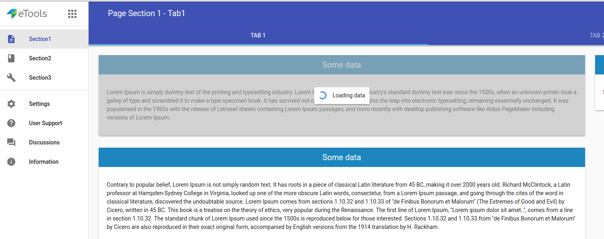
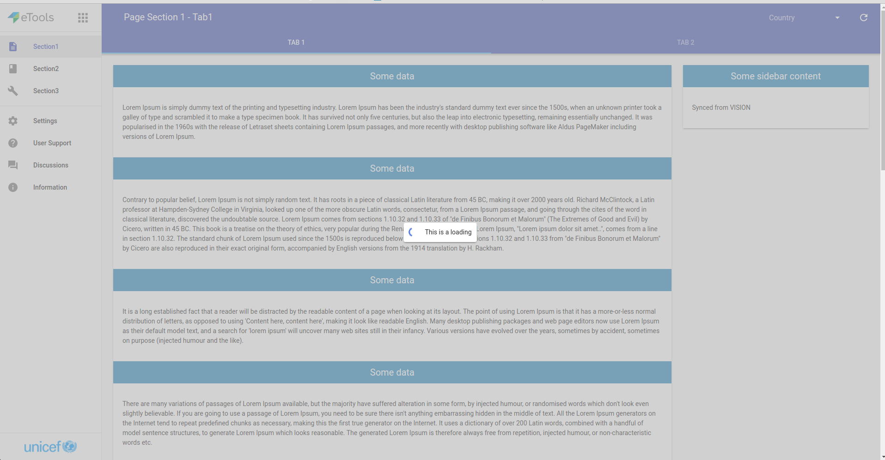

# \<etools-loading\>

Loading spinner.

You can use this loading element:
- with an overlay: 
    - default state has the loading spinner, message and overlay will be shown over your content area; 
    make sure your content area has position relative.
    
    - absolute position: the loading will cover entire screen. If you use Polymer Starter Kit, 
    use `etoolsBehaviors.LoadingBehavior` to create the loading element when your custom element is stamped (`createLoading`);
    make sure you remove the loading element in your element detached state using `removeLoading(loadingElement)`.
    
- simple, no overlay, inline block: the loading spinner and the message will be displayed inline-block.

## Styling

You can use defined variables for styling.

Custom property | Description | Default
----------------|-------------|----------
`--etools-loading-overlay-transparency` | Overlay transparency | `0.6`
`--etools-loading-msg-color` | Loading message color | `#333333`
`--etools-loading-spinner-size` | Spinner size (width & height) | `20px`
`--etools-loading-bg-color` | Background color | `#ffffff`
`--etools-loading-border-color` | Border color | `#dedede`
`--etools-loading-shadow-color` | Shadow color | `#333333`
`--etools-loading-container` | Loading container style | `{}`
`--etools-loading-message` | Loading container style | `{}`

To change spinner colors use paper-spinner styling variables([paper-spinner docs](https://elements.polymer-project.org/elements/paper-spinner))


## Usage

### Default. The loading it's placed inside a container:
```html
<etools-loading active>Loading text here...</etools-loading>
```


### Inline block loading:
```html
<etools-loading no-overlay active>Loading text here...</etools-loading>
```


### Absolute position with Polymer Starter Kit:

```javascript
// inside your custom element
behaviors: [etoolsBehaviors.LoadingBehavior],

ready: function () {
  this.loadingEl = this.createLoading("This is a loading that will cover entire screen!");
},

detached: function() {
  this.removeLoading(this.loadingEl);
}
```
You will have a loading element appended to the body.
```html
<etools-loading absolute active>Loading text here...</etools-loading>
```


Available attributes:
* active: Boolean, default: false
* loadingText: String, default: 'Loading data'
* noOverlay: Boolean, default: 'false'
* absolute: Boolean, default: 'false'

## Install
```bash
$ bower install --save etools-loading
```

## Preview element locally
Install needed dependencies by running: `$ bower install`.
Make sure you have the [Polymer CLI](https://www.npmjs.com/package/polymer-cli) installed. Then run `$ polymer serve` to serve your element application locally.

## Running Tests

```
$ polymer test
```
