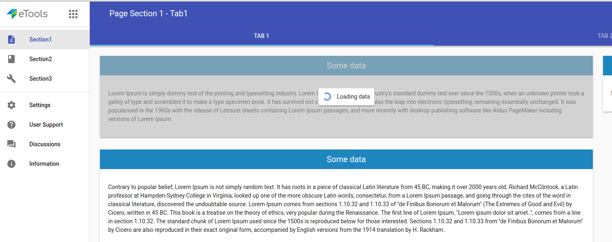
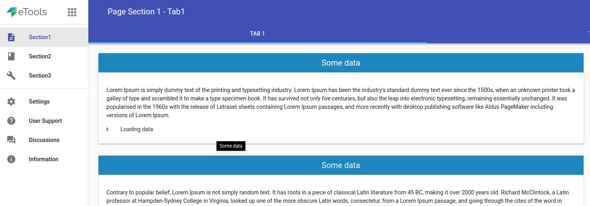
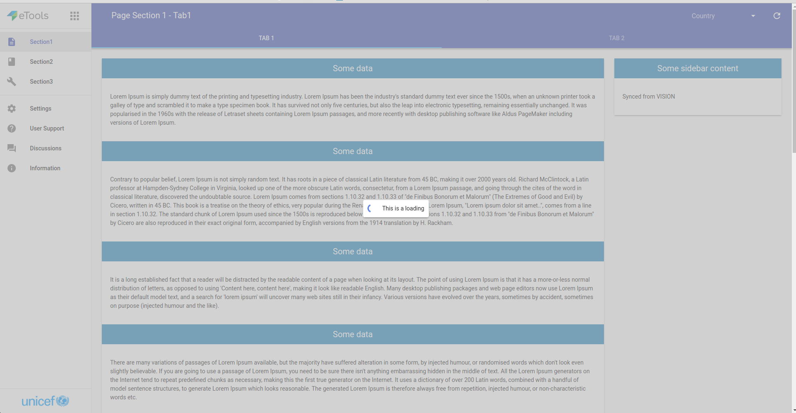

# \<etools-loading\>

Loading spinner.

You can use this loading element:
- with an overlay:
    - default state has the loading spinner, message and overlay will be shown over your content area;
    make sure your content area has position relative.

    - absolute position: the loading will cover entire screen. Use `LoadingMixin` to create the loading element when your custom element is stamped (`createLoading`);
    make sure you remove the loading element in your element detached state using `removeLoading(loadingElement)`.

	- By default, the overlay will be displayed over the `body`, but if `LoadingMixin` it's used and element has a property named `loadingContainer`
	pointing to an HTMLElement then this area will be covered.

- simple, no overlay, inline block: the loading spinner and the message will be displayed inline-block.

## Usage

### Default. The loading it's placed inside a container:
```html
<etools-loading active>Loading text here...</etools-loading>
```


### Inline block loading:
```html
<etools-loading no-overlay active>Loading text here...</etools-loading>
```


### Absolute positioning
```html
<etools-loading absolute active>Loading text here...</etools-loading>
```


## Install
TODO: create npm package
```bash
$ npm i --save unicef-polymer/etools-loading#branch_name
```

## Preview element locally
Install needed dependencies by running: `$ npm install`.
Make sure you have the [Polymer CLI](https://www.npmjs.com/package/polymer-cli) installed. Then run `$ polymer serve` to serve your element application locally.


Update demo interface: `$ polymer analyze demo/index.html > analysis.json`

## Linting the code

Install local npm packages (run `npm install`)
Then just run the linting task

```bash
$ npm run lint
```

## Running Tests
TODO: improve and add more tests
```
$ polymer test
```
